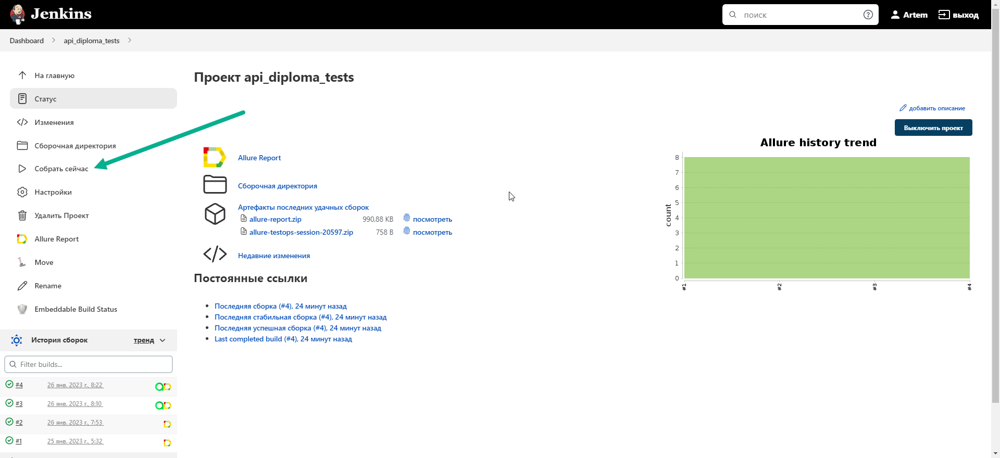
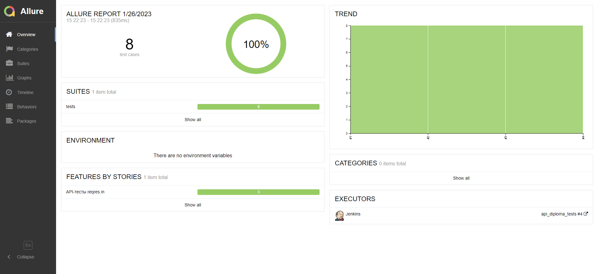
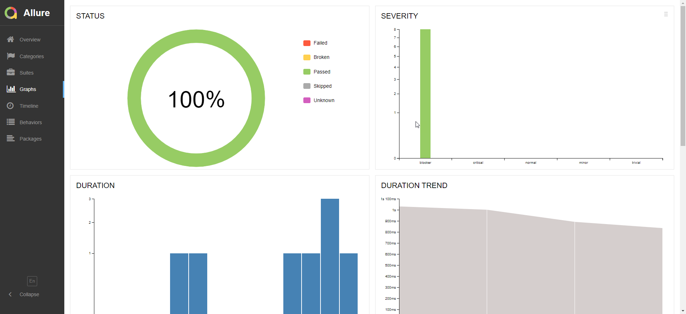
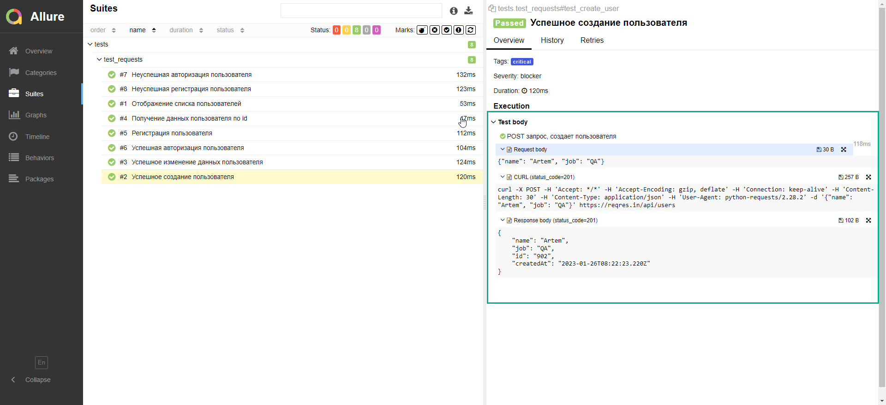
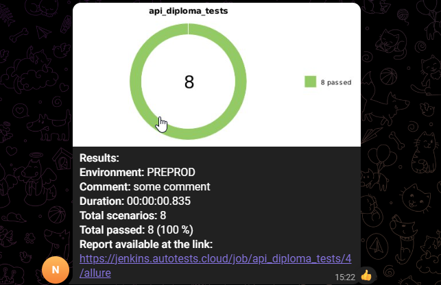
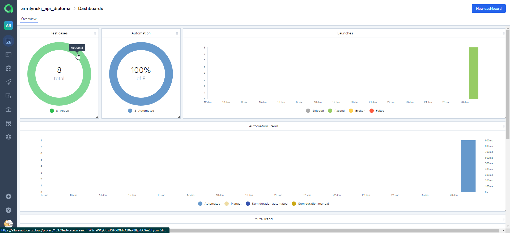
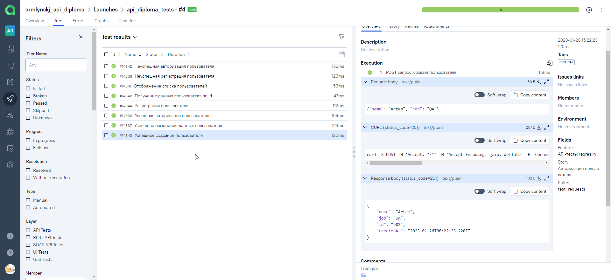
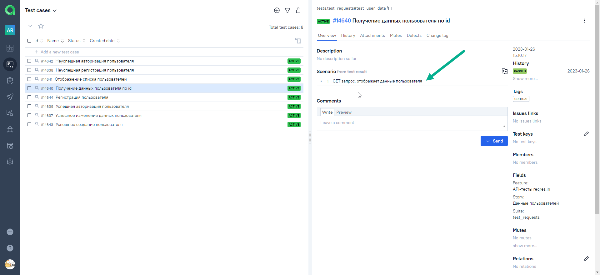
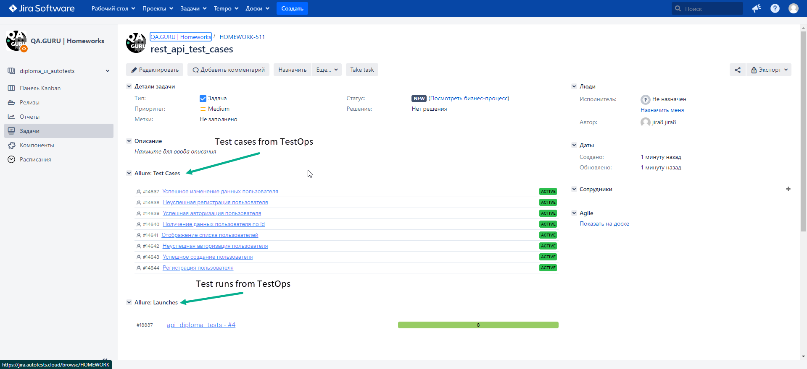

# Project REST API autotests for reqres.in
<!-- Technology -->

## Используемые инструменты и фреймворки:

  <code></code>
  <code></code>
  <code></code>
  <code></code>
  <code></code>
  <code></code>
  <code></code>
  <code></code>
  <code></code>
  <code></code>
  <code></code>

<!-- Тест кейсы -->

## Что проверяют автотесты:
* Успешная регистрация пользователя
* Успешная авторизация пользователя
* Успешное создание пользователя
* Получение данных пользователя по id
* Изменение данных пользователя
* Отображение списка пользователей
* Неуспешная авторизация пользователя
* Неуспешная регистрация пользователя

<!-- Jenkins -->

##  Запуск проекта в Jenkins

## [Job](https://jenkins.autotests.cloud/job/api_diploma_tests)

#### Когда нажимаем "Собрать сейчас" начнется сборка билда, запустятся тесты.

<!-- Allure report -->

##  Allure report

#### После прохождения всех тестов, генерируется Allure отчет, в котором есть вся информация о тестах, которые были запущены

#### Во вкладке Graphs можно посмотреть графики о прохождении тестов, по их приоритезации, по времени прохождения и др.

#### Во вкладке Suites находятся собранные тест кейсы, к которым прикрепляются аттачменты: Request body, Response body, CURL

<!-- Telegram -->

##  Проект так же интегрирован с Telegram
#### По окончании прохождения тестов, бот присылает сообщение с информацией о test run'е, в сообщении содержится ссылка на Allure отчет

<!-- Allure TestOps -->

##  Интеграция с Allure TestOps

#### Вся отчетность сохраняется в Allure TestOps, где есть вся аналогичная информация с Allure отчета

#### Dashboard:

#### Launches:

#### После того, как мы запускаем сборку в Jenkins, Allure TestOps автоматически создает test suites, test cases на основе нашего кода:

#### На вкладке с тестами, мы можем:
- Управлять всеми тест-кейсами (стандартный функционал для TMS)
- Запускать тесты по отдельности, если они автоматические, то они запустятся на сервере в Jenkins
- Интегрировать с Jira

#### Если мы запустили test run, то на вкладке "launches", мы можем:
- Наблюдать, как будут проходить тесты в live режиме
- Перезапускать тесты, если они со статусом broken и failed
- Перезапускать тесты мануально, если, к примеру, у нас проблема с окружением
- Создавать дефекты

<!-- Jira -->

##  Интеграция с Jira
#### Настроив через Allure TestOps интеграцию с Jira, мы можем отправлять тест-кейс и тест раны в Jira

